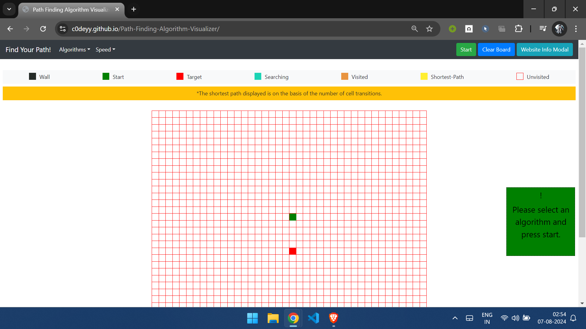
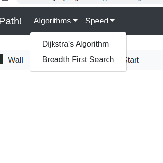
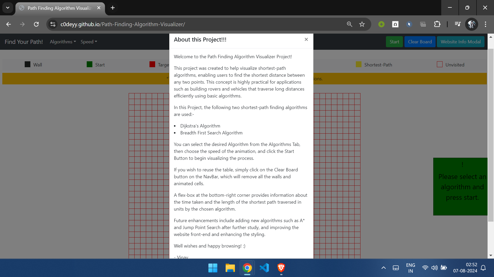
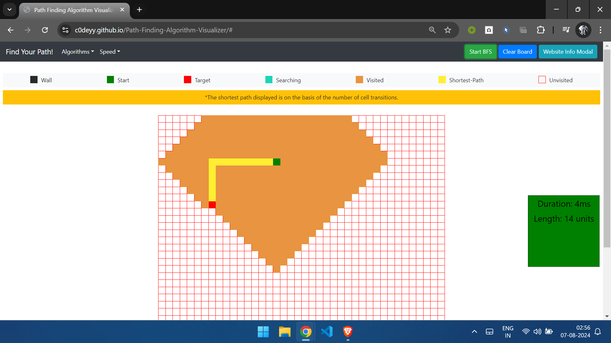

# Path-Finding-Algorithm-Visualizer
A web-based application to visualize shortest-path algorithms like Dijkstra's Algorithm and Breadth-First Search. Created with HTML, CSS, and JavaScript, it allows users to interactively explore pathfinding concepts and algorithms.

This is a simple web-based application created by me to develop a path-finding algorithm visualizer.

I have used simple technologies like:

1. `HTML`.

2. `CSS`.

3. `JavaScript`.

Our web-app can serve the following functionalities:

1. Select `Algorithm` of choice, mainly `Breadth-First-Search` and `Dijkstra's Algorithm`.

2. Select `speed of animation`

3. For more info about the project, the user can visit the `InfoModal` tab.

After the algorithm and the speed of the animation are selected, users can put walls (black-colored squares) to specify blockages in the traversed path.

After that, the user can click the `Start` button to begin the visualization of the algorithm.

After the whole process is completed, for reuse, you can click on the `clear-board` button.

I intend to improve it further and bring in more algorithms like `A*` and `Jump Point Search`.

---
## Live Demo

[Live Demo](https://c0deyy.github.io/Path-Finding-Algorithm-Visualizer/)
